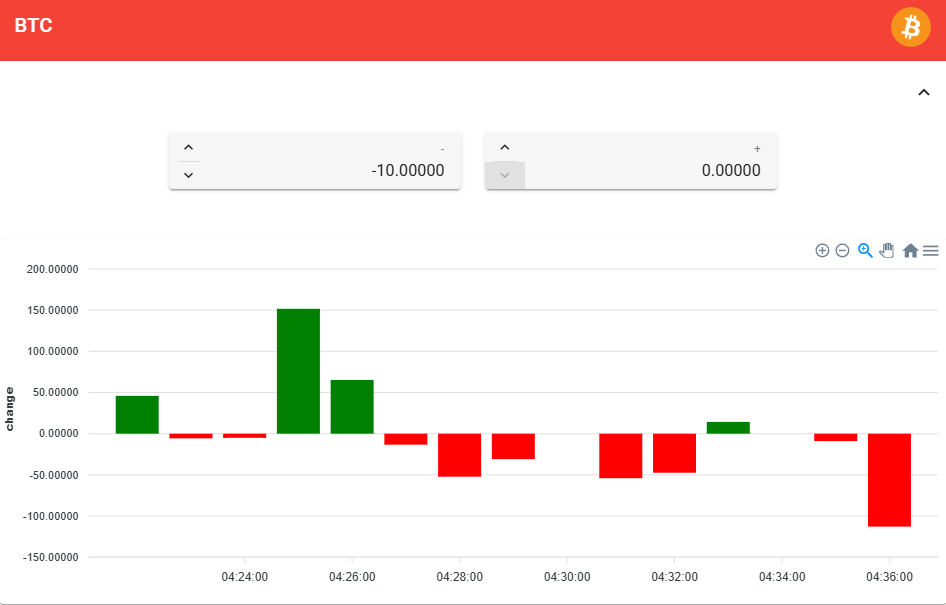

# FOLLOW COIN 
> Follow-Coin is an fully **Event-Driven Microservice** project, that helps you track your **crypto portfolio changes**. \
> It is designed to run in **AWS Fargate** with **SQS**.

## Overview 

## Set your negative / positive limits

## Get a visual hint if the limit is crossed

## More Features
1. **Fail-Safe** thanks to **microservice architecture** (same services exists multiple times)  
2. **Event-Driven** architecture through **reactive programming** and **AWS SQS** (at least once  delivery)   
3. Filters duplicates automatically  
4. Uses **Coinbase-API** for reliable data   

## CDK and Github Actions
I added a Github Actions scripts for deployment to AWS ECR. [Github Actions link](https://github.com/just-rene/follow-coin-public/tree/main/.github/workflows)  
A proper CDK script will be in the next version.

